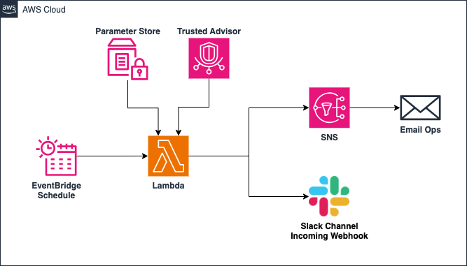

# AWS Service Limits Monitor with Trusted Advisor 🚀

This project implements an AWS monitoring solution to track and notify when specific service limits or high-risk findings are detected through AWS Trusted Advisor. The solution uses AWS Lambda, SNS, EventBridge, and Parameter Store to automate the monitoring and notification process.

---

## 🗂 Repository Structure

```bash
aws-service-limits-monitor-tf/
├── drawio/               # Diagrams and architecture designs
├── src/                  # Lambda function source code
├── .gitignore            # Files to ignore in version control
├── 01-parameter-store.tf # Terraform to manage SSM Parameter Store
├── 02a-eventbridge.tf    # Terraform to create EventBridge rule
├── 02b-lambda.tf         # Terraform to deploy Lambda function
├── 03-sns.tf             # Terraform to configure SNS topic
├── demo.tfvars.example   # Example variables file
├── main.tf               # Main Terraform configuration
├── Makefile              # Makefile for automated commands
├── provider.tf           # Provider configuration for AWS
├── README.md             # Documentation (this file)
├── variables.tf          # Variables definitions
└── versions.tf           # Required provider versions
```

---

## ⚙️ Architecture Overview

The architecture is composed of the following components:

- **EventBridge Schedule**: Triggers the Lambda function on a schedule.
- **Lambda Function**: Executes the logic to fetch Trusted Advisor checks and sends notifications.
- **Parameter Store**: Stores sensitive data such as the Slack Webhook URL.
- **Trusted Advisor**: Provides AWS resource check recommendations.
- **SNS**: Sends notifications to email and Slack channels.



---

## 🛠 How to Deploy

1. **Clone the repository**:
   ```bash
   git clone https://github.com/francotel/aws-service-limits-monitor-tf.git
   cd aws-service-limits-monitor-tf
   ```

2. **Configure your AWS credentials**:
   Ensure you have the necessary IAM permissions to deploy the resources.

3. **Customize the variables**:
   Update the `demo.tfvars` file with your specific values.

4. **Initialize Terraform**:
   ```bash
   terraform init
   ```

5. **Plan the deployment**:
   ```bash
   terraform plan -var-file=demo.tfvars
   ```

6. **Apply the deployment**:
   ```bash
   terraform apply -var-file=demo.tfvars
   ```
---

## 📧 Notifications Configuration

1. **Slack Notification**:
   - Store your Slack Incoming Webhook URL in AWS Parameter Store.
   - Ensure the `03-lambda.tf` file references the correct parameter name.

2. **Email Notification via SNS**:
   - Create an SNS Topic.
   - Subscribe an email endpoint to the SNS Topic.
   - Confirm the email subscription.

---

## 📋 Environment Variables

| Variable                  | Description                                                    |
|---------------------------|----------------------------------------------------------------|
| `SLACK_WEBHOOK_PARAM_NAME` | The name of the SSM Parameter Store key for the Slack Webhook URL. |
| `SNS_TOPIC_ARN`            | The ARN of the SNS Topic for email notifications.              |

---

## 📄 Lambda Function Logic

The Lambda function retrieves Trusted Advisor checks and formats the findings as a Slack message. It sends notifications to:

1. **Slack Channel**: Using the provided Webhook URL.
2. **SNS Topic**: Publishing a message to the SNS Topic for email notifications.


---

## 🧪 Testing

1. **Trigger the Lambda function manually** via the AWS Console or using the AWS CLI:
   ```bash
   aws lambda invoke --function-name <your_lambda_function_name> output.txt
   ```

2. **Check Slack** for the notification.
3. **Check your email inbox** for the SNS notification.

---

## 🤝 Contributing

Feel free to submit issues or pull requests if you have ideas to improve the project!

---

## 📜 License

This project is licensed under the MIT License. See the `LICENSE` file for more details.

## 🤝 Contributing

Contributions are welcome! Feel free to open an issue or submit a pull request with improvements, new features, or bug fixes.

##  🤝 **Let's Connect!**

If you find this repository useful and want to see more content like this, follow me on LinkedIn to stay updated on more projects and resources!

[](https://www.linkedin.com/in/franconavarro/)

If you’d like to support my work, you can buy me a coffee. Thank you for your support!

[](https://www.buymeacoffee.com/francotel)